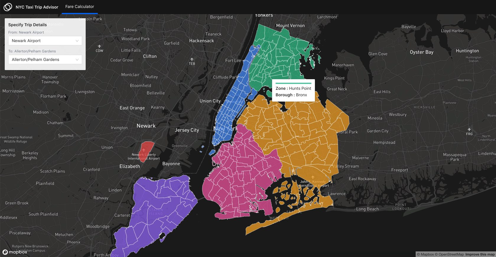
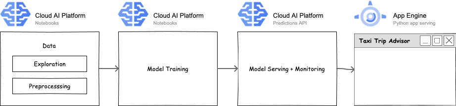

## Taxi Advisor

> Ty a live demo - [https://taxiadvisor.victordibia.com](https://taxiadvisor.victordibia.com/)

This repo provides guidance on how to design and deploy an ML product (Taxi Advisor). It covers the  end-to-end process - data ingest, model training/evaluation, serving + frontend UX. The Taxi Advisor  example uses the [New York Taxi Cab](https://www1.nyc.gov/site/tlc/about/tlc-trip-record-data.page) dataset and allows users to specify trip parameters (pickup Zone, drop off Zone and trip date/time) and provides predictions on trip duration and trip fare.

 

## How It Works

- Data is ingested from the The New York City Taxi and Limousine Commission (TLC).
- A pair of models (Random Forest, MLP) are trained (multitask mode) to both predict fare and trip time using trip parameters (pickup locationID, drop off locationID and date/time). Model is then exported to Cloud Storage.
- Model is exported imported from Cloud Storage and served (with autoscaling) using Google Cloud AI Platform [prediction API](https://cloud.google.com/ai-platform/prediction/docs/getting-started-scikit-xgboost).
- Front end application collects user trip parameters and queries Cloud AI endpoint.
  

##  Components in this Repo

The links below show how sections of Taxi Advisor are implemented.

- [Data Ingest](notebooks). 
- [Model Training](notebooks): Train a set of models (decision tree, feed forward DNN) to predict fares _and_ trip time given properties of a trip (start and end location id, time of day, etc). Write trained model to a storage bucket.
- Model Serving
  - Cloud AI Platform (Model Serving) -> load trained model from GCS, serve over end point 
- [End User Application](app)
  - App Engine (Front End App) -> serve front end app to consume CloudAI API end point.  

## TODOs

Initial high level list of tasks: 

- [x] Data exploration
  - [x] Explore interesting data insights, data transformation tasks etc 
  - [ ] Automate preprocessing using Spark
- [x] Model Training: 
  - [ ] Explore a initial set of multitask models (Random Forests, MLP), 
  - [ ] Automated hyperparameter search, 
  - [ ] Distributed training and evaluation etc. 
  - [ ] Explore bayesian models that provide principled estimates of uncertainty.
- [ ] Automated pipeline (Composer) to run model training, evaluation, export and serving.
  - [ ] Automatically promote good models to production, 
- [x] Model Serving:  
  - [ ] Serving predictions over an Cloud AI endpoint 
- [x] Front end: User interface for exploring predictions.
  - [x] App engine serving frontend 

## Acknowledgement 

Google has generously supported this work by providing Google Cloud credits as part of the [Google Developer Expert program](https://developers.google.com/community/experts)!.  🙌🙌