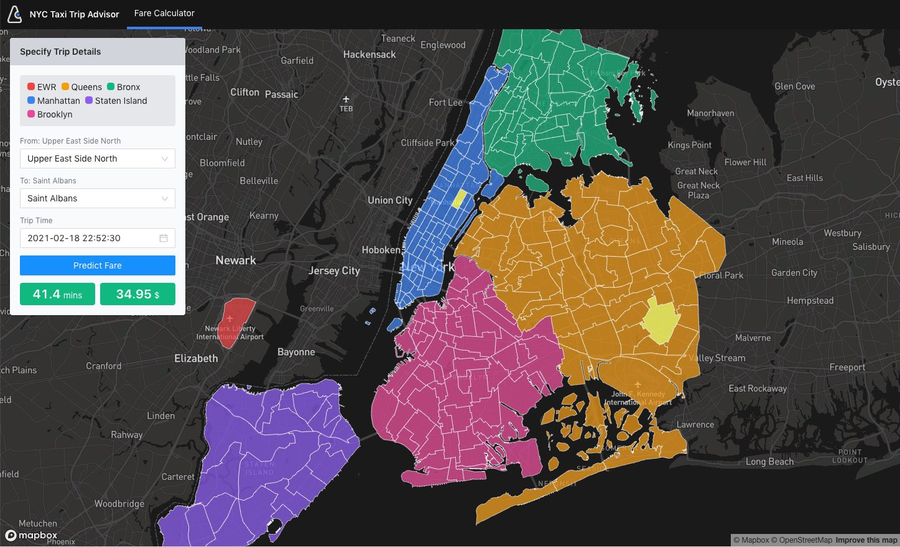

# Taxi Advisor

This repo describes how to design and deploy an ML product (Taxi Advisor). It covers the entire end-to-end process - data ingest, model training/evaluation, serving + frontend UX. 

The Taxi Advisor use case uses the NYC Taxi Cab dataset and seeks to predict a set of outcomes that are relevant for several end user personas (trip time, trip fare).

##### Screenshot of the end user application.

## Architecture and Components

- Data [New York Taxi Cab](https://www1.nyc.gov/site/tlc/about/tlc-trip-record-data.page)
- Pipeline Orchestration (Composer)
  - Composer Block -> Data Ingest  (load csv files), write to GCS
  - DataProc (Data Cleaning) -> ingest csv from GCS, clean and write result to GCS 
  - Cloud AI Platform (Model Training) -> Train a model (decision tree, feed forward DNN) to predict fares or time given properties of a trip (start and end location, time of day, etc). Write trained model to GCS
  - Cloud AI Platform (Model Serving) -> load trained model from GCS, serve over end point 
  - App Engine (Front End App) -> serve front end app to consume API end point. 
- Timeline: Two months .. Expected completion - end of Feb 2021
- ML Technologies (decision tree, feed forward DNN)

## TODOs

Initial high level list of tasks: 

- [x] Data exploration: Explore interesting data insights, data transformation tasks etc 
- [x] Model Training: Explore a set of models, automated hyperparameter search, distributed training, model evaluation etc
- [x] Automated pipeline (Composer) to run model training, export and serving.
- [ ] Model Serving: Promoting good models to production, serving predictions over an api endpoint 
- [ ] Front end: User interface for exploring predictions.